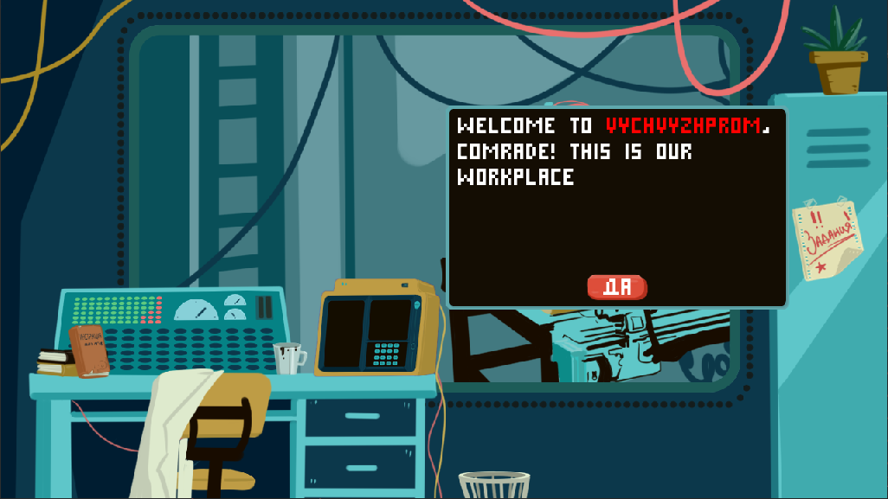
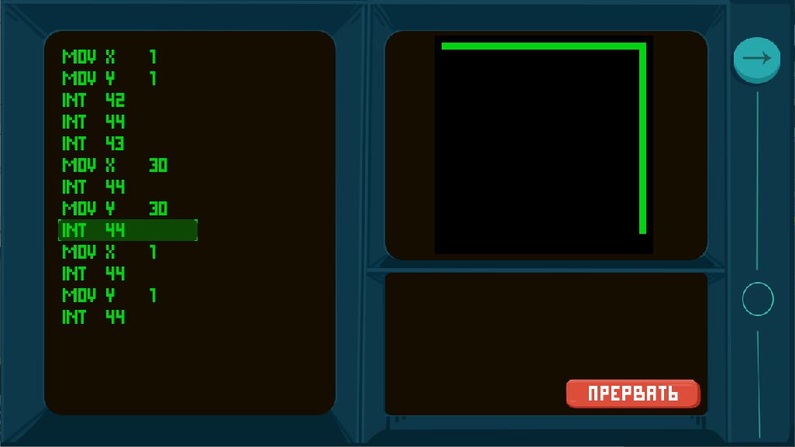
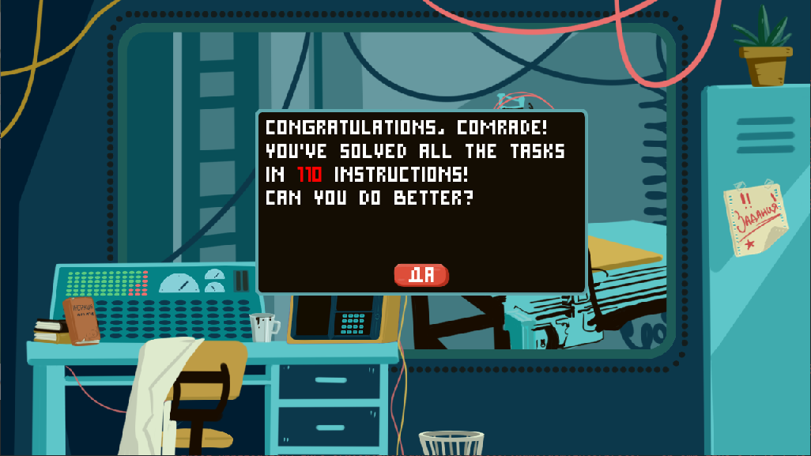

# VychVyzhProm

[Download Game (Windows, Linux, MacOs)](https://catinthedark.itch.io/vychvyzhprom)



Welcome, comrade!

In programming, to start from "nothing", you should program with punchcards or assembler at least.

In this game, you will be playing as a soviet engineer working in a ВЫЧВЫЖПРОМ (VychVyzhProm) laboratory with a task to draw simple patterns with a programmable burner device. So you have to write a code in assembler to make it move.



## Available registers:

```
X, Y (used as X and Y coordinates to move plotter)
A, B (general-purpose registers)
```

## Quick instructions set:

```
MOV A, B - move contents of B to A. B can be a register or positive or negative number
ADD A, B - move A + B to A. B can be a register or positive or negative number
MUL A, B - move A * B to A. B can be a register or positive or negative number
JMP C - jump (C - 1) lines up or down. C can be register or positive or negative number 
CMP A, B - compare A with B. A and B can be registers and numbers
JG/JE/JL C - jump if A was greater than B, equal, or less.
INT N - interrupt
```

## Supported interrupts:

```
42 - raise the burner (moving burner won't draw)
43 - lower the burner (now it leaves trace when moving)
44 - move the burner. It will be moved to coordinates stored in registers X and Y.
Use INT 44 interrupt with burner lowered to draw.
```

## Credits

From Siberia 🇷🇺 with love ❤️ and bears 🐻! 


